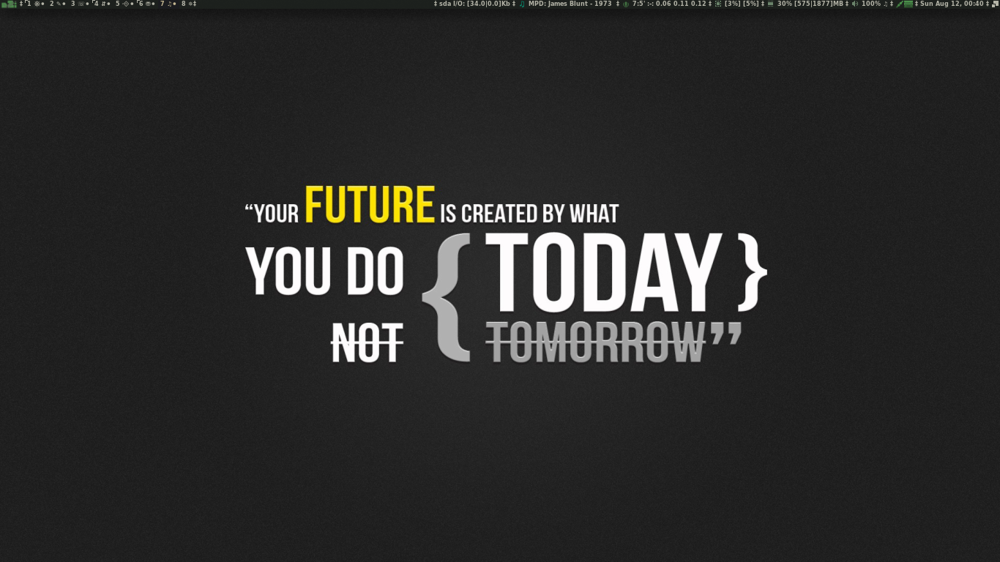
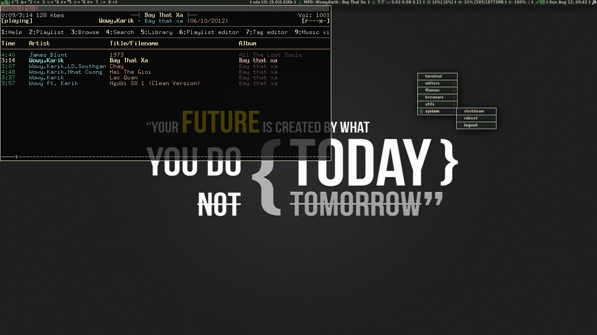

**awesome-wm-config**
=====================

# **Awesome Window Manager configurations**
[**Awesome** Window Manager Homepage](http://awesome.naquadah.org/)

* * *

xuansamdinh's Awesome WM configurations.

- - -

# Screenshots

![new1][1]
![new2][2]

## 1. Requirement:
[vicious](http://awesome.naquadah.org/wiki/Vicious)

## 2. Recommend:
[volumeicon](http://softwarebakery.com/maato/volumeicon.html)

[1]: https://raw.github.com/xuansamdinh/awesome-wm-config/master/screenshots/2012-08-12-00-40-48-1366x768.png
[2]: https://raw.github.com/xuansamdinh/awesome-wm-config/master/screenshots/2012-08-12-00-43-00-1366x768.png
